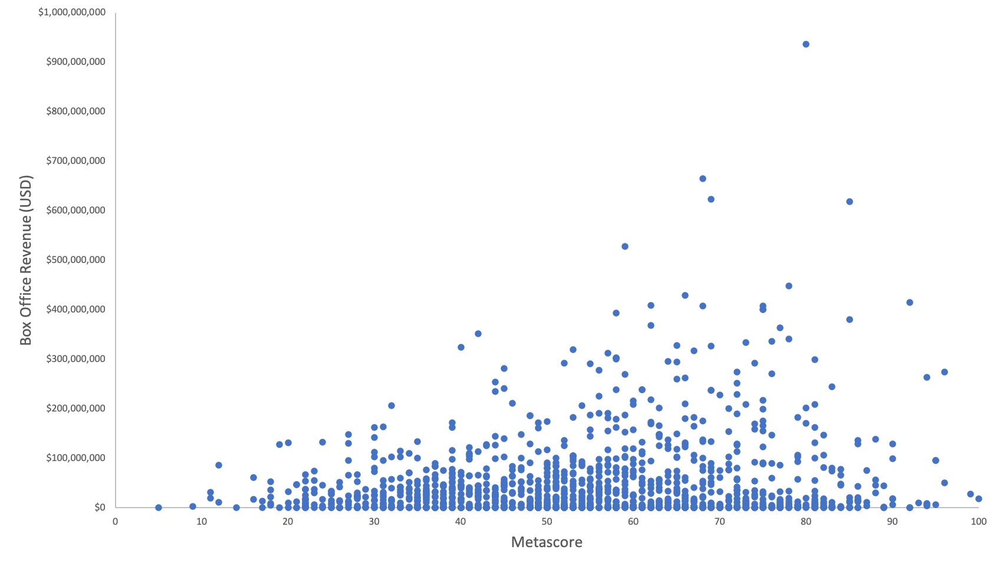
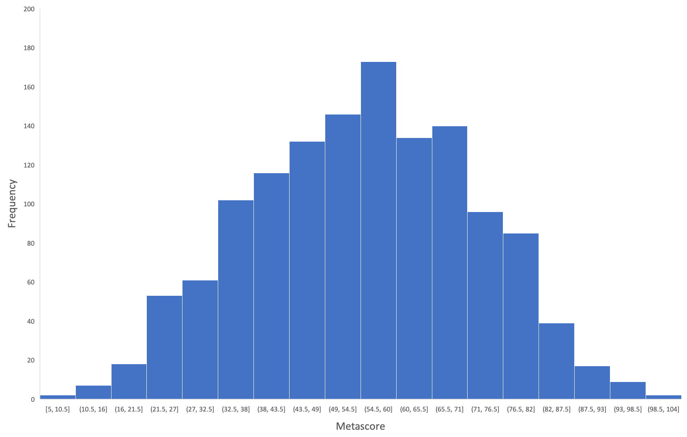

# Movie Box Office Predictor
Trained a machine learning model that will predict a movie’s financial performance based on its critical reception. 

## Data Collection
* Web scraped the top 10,000 movies over the past decade from IMDB
* Performed an API call to the OMDB website for information including box office revenue and reviews

## Visualizations
* Analyzed the data using Tableau
* There is a weak but positive correlation between Metascore and Box Office Revenue 
* Metascores are normally distributed

## Machine Learning
* Trained a linear regression model using Sci-kit Learn

## Webpage
* Used Flask, HTML, and CSS to create a webpage that allows user input a sample Metascore to predict Box Office Revenue
